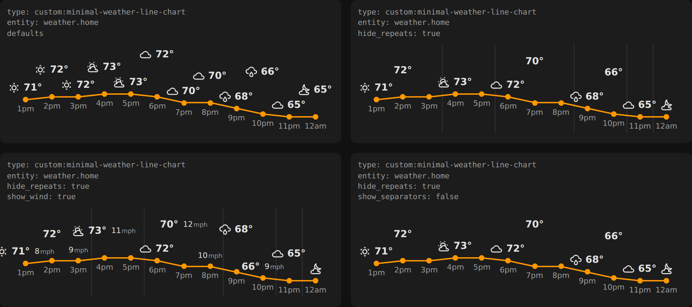
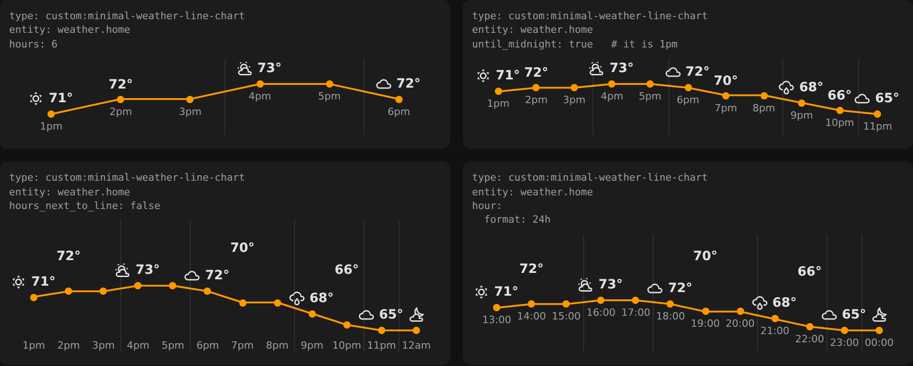
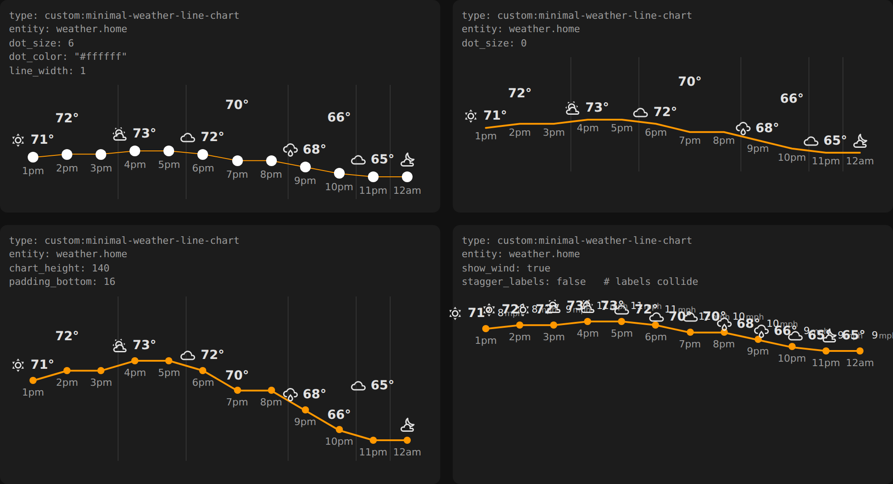
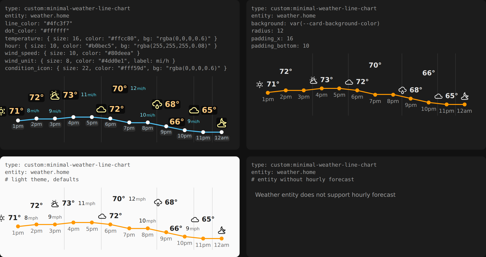

# Minimal Weather Line Chart

A Home Assistant card that shows the hourly forecast as one temperature line. Each point
carries its temperature, condition icon and (optionally) wind speed, with the hour right
underneath. Nothing else: no header, no attributes, no precipitation bars.



```yaml
type: custom:minimal-weather-line-chart
entity: weather.home
hide_repeats: true
```

It is a fork of [mlamberts78/weather-chart-card](https://github.com/mlamberts78/weather-chart-card)
with the forecast chart rebuilt from scratch. The card type is
`custom:minimal-weather-line-chart`, so it can be installed next to the original without
conflict. See [Changes from the original](#changes-from-the-original-and-why) for what is
different and why.

## Installation

### HACS

1. HACS → Frontend → ⋮ → Custom repositories.
2. Add `https://github.com/gregschwartz/minimal-weather-line-chart-home-assistant` with
   category **Dashboard**.
3. Install **Minimal Weather Line Chart** and reload the browser.

### Manual

Copy `dist/minimal-weather-line-chart.js` to `config/www/`, then add
`/local/minimal-weather-line-chart.js` as a dashboard resource (type: JavaScript module)
under Settings → Dashboards → ⋮ → Resources.

### Requirements

The weather entity must support hourly forecasts. The card subscribes to
`weather/subscribe_forecast` with `forecast_type: hourly`. If the entity cannot provide
one, the card says so in place of the chart.

## Options

Only `type` and `entity` are required. Every other option has a default that works on the
standard dark and light themes.

### What is shown

| Name | Default | Description |
| --- | --- | --- |
| `entity` | **required** | A `weather.*` entity with hourly forecast support. |
| `hide_repeats` | `false` | Hide a temperature, condition icon or wind speed when it is the same as the previous hour. |
| `show_separators` | same as `hide_repeats` | Thin vertical line wherever the condition changes, so each run of the same condition reads as a group. |
| `show_wind` | `false` | Wind speed next to the temperature, in the entity's `wind_speed_unit`. |


### Which hours

| Name | Default | Description |
| --- | --- | --- |
| `hours` | `12` | Maximum number of hours shown. |
| `until_midnight` | `false` | Only show hours before the next local midnight, for a "rest of today" card. Still capped by `hours`. Late in the evening this leaves only a few hours. |
| `hours_next_to_line` | `true` | Put each hour label directly under its data point. `false` puts all hours in a row along the bottom. |
| `hour.format` | `12h` | `12h` shows `4pm`, `24h` shows `16:00`. |



### Size and spacing

| Name | Default | Description |
| --- | --- | --- |
| `chart_height` | `84` | Height in px of the line area, including the room for labels above and hours below. With `hours_next_to_line: false` the hour row is added below this. |
| `padding_top` | auto | Space in px above the highest point. Auto is just enough for the labels. |
| `padding_bottom` | `5` | Card padding in px below the lowest content. |
| `padding_x` | `8` | Card padding in px on the left and right. |
| `line_width` | `2` | Line width in px. |
| `dot_size` | `line_width + 2` | Radius in px of the dot at each data point. `0` removes the dots. Dots mark the hours whose values are hidden by `hide_repeats`. |
| `stagger_labels` | `true` | When a label would overlap its left neighbour, lift it one row and grow the card to fit. `false` lets labels collide. |



### Colors and text

| Name | Default | Description |
| --- | --- | --- |
| `line_color` | `rgba(255, 152, 0, 1)` | Line color. |
| `dot_color` | same as `line_color` | Dot color. |
| `separator_color` | `var(--divider-color)` | Separator color. |
| `background` | `transparent` | Card background. Use `var(--card-background-color)` for a normal card. |
| `radius` | `0` | Card corner radius in px. |
| `temperature` | | Style for the temperature. |
| `hour` | | Style for the hour labels. Also takes `format` (see above). |
| `wind_speed` | | Style for the wind speed number. |
| `wind_unit` | | Style for the wind unit. Also takes `label` to replace the unit text. |
| `condition_icon` | | Style for the condition icon. |

The five style objects each accept `size` (px), `color` and `bg`. Any CSS color works,
including theme variables such as `var(--primary-text-color)`. Defaults:

| Element | size | color | bg |
| --- | --- | --- | --- |
| `temperature` | 14 | `var(--primary-text-color)` | transparent |
| `hour` | 11 | `var(--secondary-text-color)` | transparent |
| `wind_speed` | 11 | `var(--primary-text-color)` | transparent |
| `wind_unit` | 9 | `var(--secondary-text-color)` | transparent |
| `condition_icon` | 18 | `var(--primary-text-color)` | transparent |



Condition icons are Material Design Icons through `ha-icon`. When a forecast entry has
`is_daytime: false`, `sunny` and `partlycloudy` use their night variants.

### Full example

```yaml
type: custom:minimal-weather-line-chart
entity: weather.home
hours: 12
until_midnight: false
hide_repeats: true
show_wind: true
hours_next_to_line: true
chart_height: 84
padding_bottom: 5
line_color: "#4fc3f7"
dot_size: 4
dot_color: "#ffffff"
temperature:
  size: 16
  color: "#ffcc80"
  bg: rgba(0, 0, 0, 0.6)
hour:
  size: 10
  color: "#b0bec5"
  format: 12h
wind_speed:
  size: 10
  color: "#80deea"
wind_unit:
  size: 8
  label: mi/h
condition_icon:
  size: 22
  color: "#fff59d"
```

## Changes from the original, and why

| Change | Reason |
| --- | --- |
| Temperatures are plain text instead of Chart.js datalabels | The original draws each temperature in a box whose background comes from `--card-background-color` and whose text comes from `--primary-text-color`, read off `document.body`. On some themes those resolve to the same color or to nothing, so the numbers vanish and only a white box is left. Plain text in the DOM always uses the theme's text color. |
| `hide_repeats` | Repeating a value that has not changed since the previous hour is noise. With repeats hidden, what remains is exactly the hours where something changes. |
| Separators between condition groups | With repeats hidden, an icon only appears when the condition changes. A faint line at each change (cloudy, cloudy, cloudy, sunny, cloudy is 3 groups and 2 lines) shows how long each condition lasts. |
| Dots on every data point | The line still has a point for every hour even when its label is hidden. The dots make those hours visible. |
| Hours are `4pm`, never `4:00 PM` | Twelve columns are narrow. The short form fits and reads faster. |
| Hour label under each point | Reading a value and then hunting for its hour along the bottom edge is slow. Keeping them together is faster. The bottom row is still available. |
| Much less vertical space, all of it configurable | The original chart is 180px tall with generous padding. This one is 84px by default, with controls for height, top padding, bottom padding and side padding. |
| Condition icon and wind next to the temperature | The original stacked icons and wind in separate rows above and below the chart. Everything for one hour is now one group. |
| Wind is optional and off by default | Most of the time only the temperature line matters. |
| Per-element size, color and background | So the card can match any dashboard theme. |
| `until_midnight` and `hours` | For "rest of today" and "next N hours" cards. |
| Automatic label staggering | Twelve hours of icon plus temperature plus wind do not fit on one row in a normal-width card. A label that would collide with its left neighbour is lifted one row and the card grows to fit. |
| New card type `custom:minimal-weather-line-chart` | A different element name, so it can be installed alongside the original `weather-chart-card`. |
| No Chart.js, no datalabels plugin, no canvas, no Lit | The card is one file with no dependencies, and `dist/minimal-weather-line-chart.js` is the source as-is. |

The original card's source is still in the repo (`src/main.js`) and builds to
`dist/weather-chart-card.js`, but HACS installs only the new card. The original README is
at [docs/upstream-README.md](docs/upstream-README.md).

## Development

```
npm install
npm run build      # eslint + rollup, writes dist/minimal-weather-line-chart.js
```

The screenshots in `docs/screenshots/` are rendered outside Home Assistant with stand-ins
for `ha-card` and `ha-icon` (real Material Design Icons, default system font), so exact
fonts differ slightly from a live dashboard.

## License

MIT, same as the upstream project. See `LICENSE.md`.
